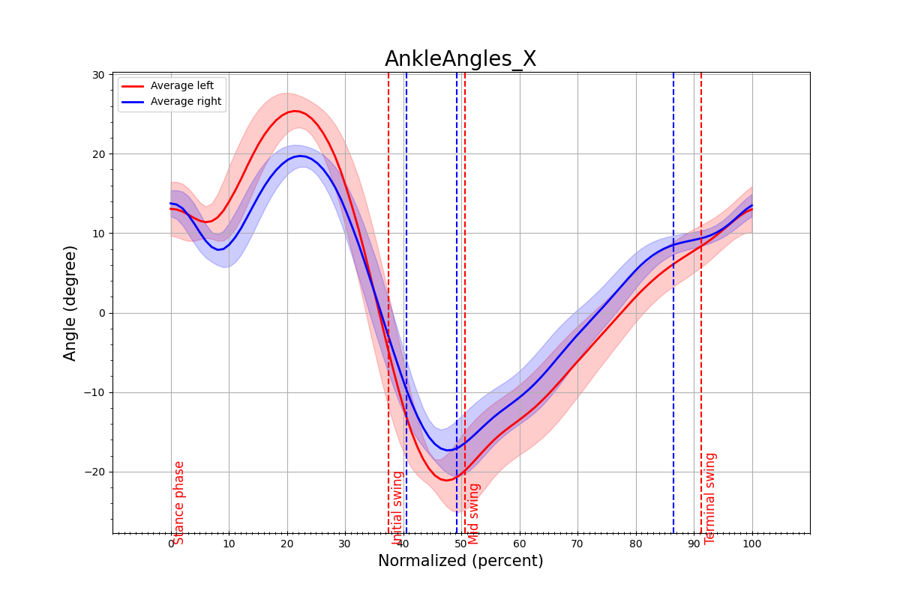
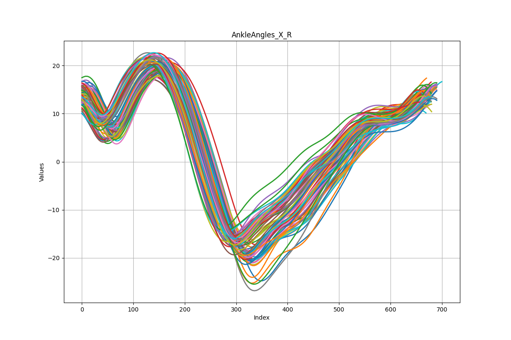
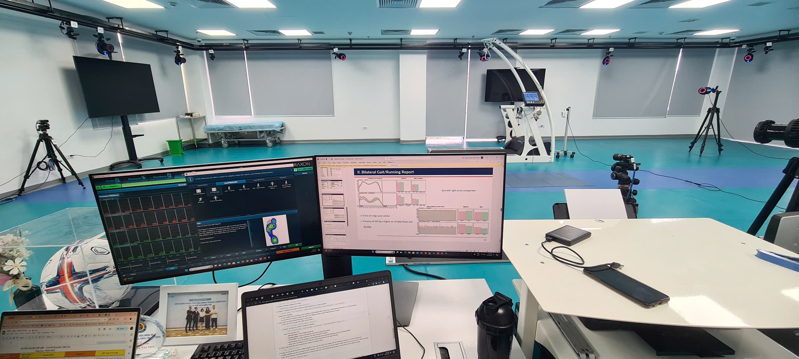
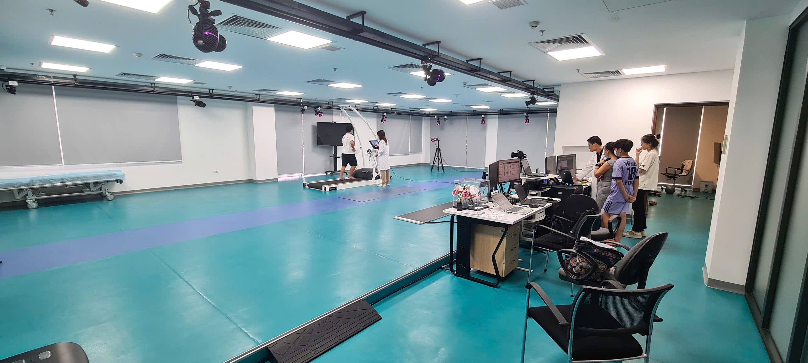
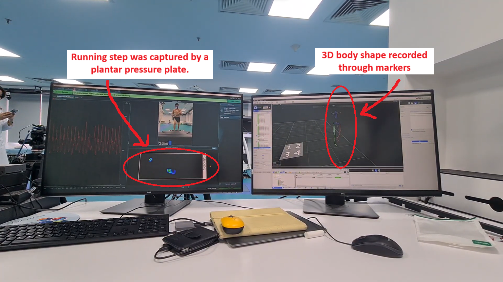

# Joint-Angles-Visuallization-in-Running-Exercise-with-marker-based-system

This project automates the analysis of running biomechanics by measuring joint angles (knee, pelvis, hip, ankle) during a running cycle. It synchronizes data from the MR3 plantar pressure system and the Nexus motion capture system to provide insights into running performance and potential injury risks. The code processes plantar pressure data to define running cycles and then maps angle data from motion capture to those cycles, handling variability in cycle length and segmented input files.

## Key Features

*   **Data Synchronization:** Integrates data from MR3 and Nexus systems based on timestamps.
*   **Cycle Identification:** Automatically identifies start and end frames for each running cycle from plantar pressure data.
*   **Angle Extraction:** Extracts and processes joint angle data for each identified running cycle.
*   **Cycle Normalization:** Scales each cycle to a uniform length for comparative analysis.
*   **Statistical Analysis:** Calculates average angle trajectories and standard deviations.
*   **Data Visualization:** Generates plots of joint angles over the running cycle.

## Output
*   Agnle Angle in cycle.

*   Agnle Angle of Right Led before average, where each line stands for one cycle, Will create the blue line in the main graph

*   The left leg has one similar to that.

After the code finishes running, it will generate 36 sets of graphs, of 12 angles.
## Project Documentation

This project is accompanied by two documents that provide different levels of detail:

*   **Project Detail.pdf:**  _This document provides a comprehensive overview of the project, detailing the problem statement, methodology, and implementation. It includes in-depth explanations of data processing algorithms, system architecture, and challenges overcome during development. This is the primary resource for understanding the technical aspects of the project._ [Project Detail.pdf](https://mt-chuyen.github.io/Joint-Angles-Visuallization-in-Running-Exercise-with-marker-based-system/Project%20Detail.pdf)

*   **Slide.pdf:** _This presentation offers a visual walkthrough of the project, showcasing key concepts, results, and system workflow. It is designed to provide a more accessible and intuitive introduction to the project for readers who prefer a high-level overview with graphical representations of data and processes._ [Slide.pdf](https://mt-chuyen.github.io/Joint-Angles-Visuallization-in-Running-Exercise-with-marker-based-system/Slide.pdf)

[Link_to_Github](https://github.com/MT-Chuyen/Joint-Angles-Visuallization-in-Running-Exercise-with-marker-based-system/tree/main/Project%20Code)
## Let's take a look at some visuals of the lab.
*   A system of 24 cameras around the ceiling will capture 3D data of each marker and the foot pressure recording plate will simultaneously determine the movement cycle.

